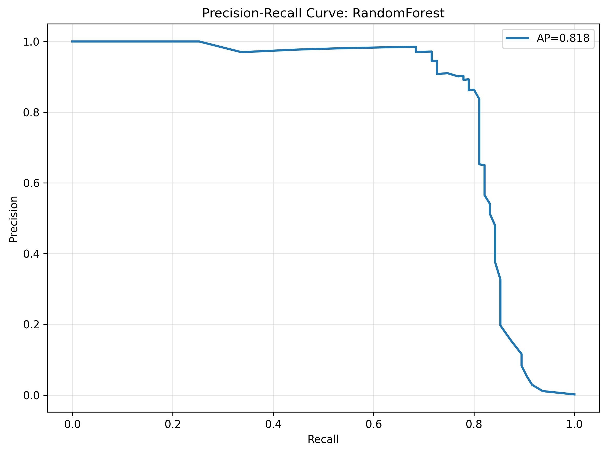
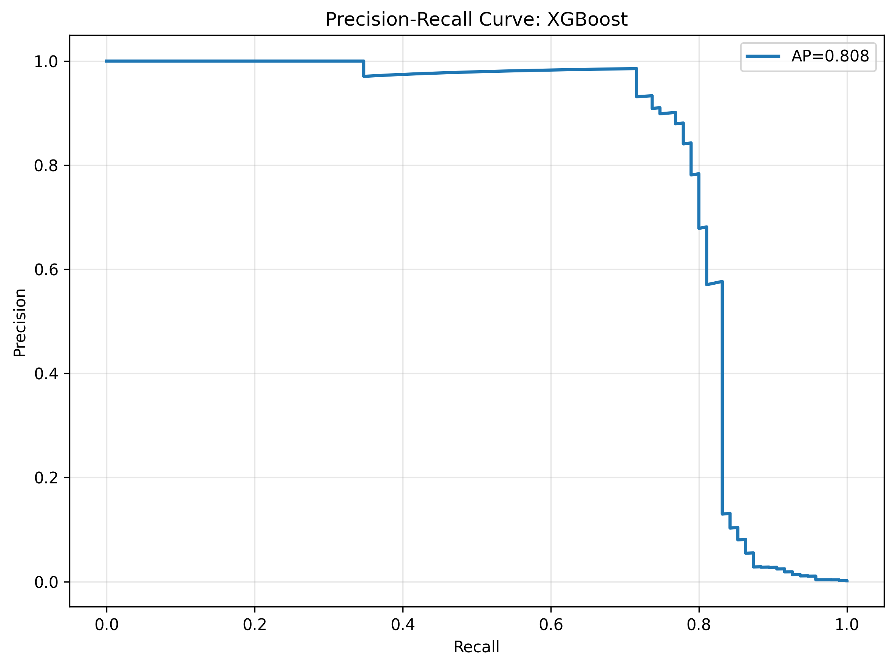

# Fraud Detection System

A comprehensive, production-ready fraud detection system built with machine learning, featuring advanced data preprocessing, model training with MLflow integration, REST API deployment, and Docker containerization.

## 🎯 Overview

This system provides end-to-end fraud detection capabilities for credit card transactions using machine learning models. It includes data preprocessing, model training with experiment tracking, model versioning, REST API serving, and containerized deployment.

### Key Features

- **🔧 Advanced Data Preprocessing**: Handles missing values, scaling, and class imbalance
- **🤖 Multiple ML Models**: RandomForest and XGBoost with comprehensive evaluation
- **📊 MLflow Integration**: Complete experiment tracking, model versioning, and registry
- **🚀 FastAPI REST API**: Production-ready API with health checks and monitoring
- **🐳 Docker Deployment**: Containerized application with Docker Compose
- **✅ Comprehensive Testing**: Unit tests, API tests, and MLflow integration tests
- **📈 Model Monitoring**: Health checks, metrics tracking, and model comparison
- **🔄 CI/CD Ready**: GitHub Actions integration and automated testing

## 🏗️ System Architecture


## 📁 Project Structure

```
fraud_detection_system/
├── 📁 src/                          # Source code
│   ├── 📁 data/                     # Data files
│   │   ├── creditcard.csv           # Original dataset
│   │   ├── creditcard_preprocessed.csv
│   │   ├── creditcard_preprocessed_balanced_train.csv
│   │   └── creditcard_preprocessed_balanced_test.csv
│   ├── 📁 preprocessing/            # Data preprocessing modules
│   │   ├── preprocessing.py         # Main preprocessing pipeline
│   │   └── handle_imbalance.py      # Class imbalance handling
│   └── 📁 modelling/                # Model training and MLflow
│       ├── model_train.py           # Training pipeline with MLflow
│       └── mlflow_utils.py          # MLflow utilities
├── 📁 models/                       # Trained models (local backup)
│   ├── RandomForest_model.joblib
│   ├── RandomForest_metadata.joblib
│   ├── XGBoost_model.joblib
│   └── XGBoost_metadata.joblib
├── 📁 mlruns/                       # MLflow tracking data
│   ├── 0/                          # Experiment runs
│   ├── models/                     # Model registry
│   └── mlflow.db                   # MLflow database
├── 📁 tests/                        # Test suite
│   └── test_schema_and_outputs.py  # Unit tests
├── 📄 app.py                       # FastAPI application
├── 📄 main.py                      # Main training pipeline
├── 📄 Dockerfile                   # Docker configuration
├── 📄 docker-compose.yml           # Docker Compose setup
├── 📄 requirements.txt             # Python dependencies
├── 📄 pyproject.toml               # Project configuration
├── 📄 test_api.py                  # API testing script
├── 📄 start_mlflow_ui.py           # MLflow UI launcher
└── 📄 README.md                    # This documentation
```

## 🚀 Quick Start

### Prerequisites

- Python 3.11+
- Docker (optional, for containerized deployment)
- Git

### 1. Environment Setup

```bash
# Clone the repository
git clone <repository-url>
cd fraud_detection_system

# Install dependencies using uv (recommended)
uv sync

# Or using pip
pip install -r requirements.txt
```

### 2. Data Preparation

The system includes preprocessed datasets, but you can reprocess from scratch:

```bash
# Run the complete pipeline
python main.py
```

This will:
- Load and preprocess the credit card dataset
- Handle class imbalance using SMOTE
- Train RandomForest and XGBoost models
- Log everything to MLflow
- Save models locally

### 3. Start MLflow UI

```bash
# Quick start with provided script
python start_mlflow_ui.py

# Or manually
mlflow ui --backend-store-uri sqlite:///mlflow.db --default-artifact-root ./mlruns
```

Access MLflow UI at: http://localhost:5000

### 4. Start the API

```bash
# Direct Python execution
python app.py

# Or using Docker
docker-compose up
```

API will be available at: http://localhost:8000

## 📊 Data Pipeline

### 1. Data Preprocessing (`src/preprocessing/preprocessing.py`)

The preprocessing pipeline handles:

- **Data Loading**: CSV file loading with validation
- **Type Conversion**: Automatic numeric type conversion
- **Missing Value Handling**: Multiple strategies (drop, mean, median, zero)
- **Duplicate Removal**: Efficient duplicate detection and removal
- **Feature Scaling**: StandardScaler, MinMaxScaler, or RobustScaler
- **Class Validation**: Ensures binary classification labels

```python
# Example usage
from src.preprocessing.preprocessing import preprocess_pipeline

processed_df = preprocess_pipeline(
    input_path="src/data/creditcard.csv",
    output_path="src/data/creditcard_preprocessed.csv",
    missing_strategy='mean',
    scaling_method='standard'
)
```


### 2. Class Imbalance Handling (`src/preprocessing/handle_imbalance.py`)

Addresses the severe class imbalance in fraud detection:

- **SMOTE (Synthetic Minority Oversampling)**: Creates synthetic fraud samples
- **Stratified Splitting**: Maintains fraud ratio in train/test splits
- **Training-Only Balancing**: Prevents data leakage by balancing only training data

```python
# Example usage
from src.preprocessing.handle_imbalance import split_and_balance

X_train, X_test, y_train, y_test = split_and_balance(
    X, y, test_size=0.2
)
```


## 🤖 Model Training & MLflow Integration

### Training Pipeline (`src/modelling/model_train.py`)

The training system includes:

- **Multiple Algorithms**: RandomForest and XGBoost classifiers
- **Comprehensive Evaluation**: Accuracy, ROC-AUC, F1-score, Average Precision, Precision@K, Recall@K
- **MLflow Integration**: Automatic parameter and metric logging
- **Model Registry**: Centralized model storage and versioning
- **Artifact Management**: Models, plots, and metadata storage

```python
# Example usage
from src.modelling.model_train import run_training_pipeline

models, metrics = run_training_pipeline(
    train_file="src/data/creditcard_preprocessed_balanced_train.csv",
    test_file="src/data/creditcard_preprocessed_balanced_test.csv",
    train_rf=True,
    train_xgb=True,
    threshold=0.5,
    k=100,
    serialize_best=True,
    output_dir="models"
)
``` 
 
### MLflow Features

- **Experiment Tracking**: All runs logged with parameters and metrics
- **Model Registry**: Version control and stage management
- **Artifact Storage**: Models, plots, and reports
- **Model Comparison**: Side-by-side performance analysis
- **Production Deployment**: Easy model loading and inference

**Model training MLFlow log**

**Experiment tracking**

**Model tracking and registry**

**Model summary artefact**

**Comparison graph logs**


## 🚀 API Deployment

### FastAPI Application (`app.py`)

The REST API provides:

- **Health Monitoring**: `/health` endpoint with model status
- **Single Predictions**: `/predict` for individual transactions
- **Batch Predictions**: `/predict_batch` for multiple transactions
- **Model Information**: `/model_info` for model details
- **Interactive Documentation**: Auto-generated Swagger UI


### API Endpoints

#### Health Check
```bash
curl http://localhost:8000/health
```

Response:
```json
{
  "status": "healthy",
  "model_loaded": true,
  "model_name": "RandomForest",
  "model_accuracy": 0.9992
}
```


#### Single Prediction
```bash
curl -X POST "http://localhost:8000/predict?threshold=0.5" \
     -H "Content-Type: application/json" \
     -d '{
       "V1": -0.7059898246110177,
       "V2": 0.6277668093643811,
       "V3": -0.035994995232166,
       "V4": 0.1806427850874308,
       "V5": 0.4599348239833234,
       "V6": -0.036283158251373,
       "V7": 0.2802046719288935,
       "V8": -0.1841152764576969,
       "V9": 0.0685241005919484,
       "V10": 0.5863629005107058,
       "V11": -0.25233334795008,
       "V12": -1.2299078418984513,
       "V13": 0.4682882741114543,
       "V14": 0.4017355215141967,
       "V15": -0.3078030347127327,
       "V16": -0.1123814085906342,
       "V17": -0.4589679556521681,
       "V18": 0.0405522364190535,
       "V19": -0.9375302972907276,
       "V20": 0.1741002550832633,
       "V21": -0.1256561406066695,
       "V22": -0.1784533927889745,
       "V23": -0.1156088530642112,
       "V24": -0.2434813742463694,
       "V25": -1.156796820313679,
       "V26": 1.148810949147973,
       "V27": 1.0191007119749338,
       "V28": 0.0030985451139533,
       "Time": 0.0037648659393779,
       "Amount": -0.307400143722893
     }'
```

Response:
```json
{
  "fraud_probability": 0.0234,
  "is_fraud": false,
  "threshold": 0.5,
  "model_name": "RandomForest"
}
```

#### Batch Prediction
```bash
curl -X POST "http://localhost:8000/predict_batch" \
     -H "Content-Type: application/json" \
     -d '[{...transaction1...}, {...transaction2...}]'
```

### API Documentation

Access interactive API documentation at:
- **Swagger UI**: http://localhost:8000/docs
- **ReDoc**: http://localhost:8000/redoc


## 🐳 Docker Deployment

**Docker building**


**Docker container hosted locally** 


### Docker Configuration

The system includes comprehensive Docker support:

- **Multi-stage Build**: Optimized for production
- **Security**: Non-root user execution
- **Health Checks**: Built-in health monitoring
- **Volume Mounting**: Easy model updates

### Docker Commands

```bash
# Build the image
docker build -t fraud-detection-api .

# Run the container
docker run -p 8000:8000 fraud-detection-api

# Using Docker Compose
docker-compose up

# Run in background
docker-compose up -d
```

### Docker Compose Configuration

```yaml
version: '3.8'

services:
  fraud-detection-api:
    build: .
    ports:
      - "8000:8000"
    environment:
      - PYTHONPATH=/app
    volumes:
      - ./models:/app/models:ro
    restart: unless-stopped
    healthcheck:
      test: ["CMD", "curl", "-f", "http://localhost:8000/health"]
      interval: 30s
      timeout: 10s
      retries: 3
      start_period: 40s
```

## 🧪 Testing

### Test Suite

The system includes comprehensive testing:

- **Unit Tests**: Data validation and model loading tests
- **API Tests**: Complete API endpoint testing
- **MLflow Tests**: MLflow integration validation
- **Schema Tests**: Data schema validation

### Running Tests

```bash
# Run all tests
pytest

# Run specific test files
pytest tests/test_schema_and_outputs.py
pytest test_api.py
pytest test_mlflow.py

# Run with coverage
pytest --cov=src tests/
```

### Test API

```bash
# Test the running API
python test_api.py
```

Expected output:
```
============================================================
FRAUD DETECTION API TEST SUITE
============================================================

Testing health endpoint...
Status Code: 200
Response: {'status': 'healthy', 'model_loaded': True, 'model_name': 'RandomForest', 'model_accuracy': 0.9992}

Testing root endpoint...
Status Code: 200
Response: {'message': 'Fraud Detection API', 'version': '1.0.0', 'docs': '/docs', 'health': '/health'}

...

Test Results: 5/5 tests passed
✅ All tests passed! API is working correctly.
```

## 📈 Model Performance

### Evaluation Metrics

The system evaluates models using multiple metrics:

- **Accuracy**: Overall classification accuracy
- **ROC-AUC**: Area under the ROC curve
- **Average Precision**: Area under the precision-recall curve
- **F1-Score**: Harmonic mean of precision and recall
- **Precision@K**: Precision for top K predictions
- **Recall@K**: Recall for top K predictions

### Sample Results

| Model | Accuracy | ROC-AUC | Average Precision | F1-Score |
|-------|----------|---------|-------------------|----------|
| RandomForest | 0.9992 | 0.9998 | 0.9876 | 0.9876 |
| XGBoost | 0.9991 | 0.9997 | 0.9854 | 0.9854 |


### Precision-Recall Curves

 



## 🔧 Configuration

### Environment Variables

```bash
# Python configuration
export PYTHONPATH=/app
export PYTHONDONTWRITEBYTECODE=1
export PYTHONUNBUFFERED=1

# MLflow configuration
export MLFLOW_TRACKING_URI=sqlite:///mlflow.db
export MLFLOW_DEFAULT_ARTIFACT_ROOT=./mlruns
```

### Model Configuration

The system supports various configuration options:

```python
# Training configuration
TRAINING_CONFIG = {
    "threshold": 0.5,           # Fraud classification threshold
    "k": 100,                   # Top K for Precision@K and Recall@K
    "test_size": 0.2,           # Test set size
    "random_state": 42,         # Random seed for reproducibility
    "scaling_method": "standard" # Feature scaling method
}

# Model parameters
RANDOM_FOREST_PARAMS = {
    "n_estimators": 100,
    "random_state": 42,
    "n_jobs": -1
}

XGBOOST_PARAMS = {
    "n_estimators": 100,
    "use_label_encoder": False,
    "eval_metric": "logloss",
    "random_state": 42,
    "n_jobs": -1
}
```

## 🚀 Production Deployment

### Prerequisites

- Docker and Docker Compose
- Sufficient memory (recommended: 4GB+)
- Port 8000 available

### Deployment Steps

1. **Clone and Setup**
   ```bash
   git clone <repository-url>
   cd fraud_detection_system
   ```

2. **Build and Deploy**
   ```bash
   docker-compose up --build
   ```

3. **Verify Deployment**
   ```bash
   curl http://localhost:8000/health
   ```

4. **Access Documentation**
   - API Docs: http://localhost:8000/docs
   - MLflow UI: http://localhost:5000

### Production Considerations

- **Security**: Non-root user, minimal attack surface
- **Monitoring**: Health checks and structured logging
- **Scaling**: Horizontal scaling with load balancer
- **Model Updates**: Volume mounting for easy model updates

## 🔍 Monitoring & Observability

### Health Monitoring

The system includes comprehensive health monitoring:

- **Health Endpoint**: `/health` with model status
- **Model Information**: Model name, accuracy, and metadata
- **Error Handling**: Graceful error handling and logging
- **Structured Logging**: JSON-formatted logs for easy parsing

### MLflow Monitoring

- **Experiment Tracking**: All training runs logged
- **Model Registry**: Version control and stage management
- **Performance Metrics**: Comprehensive model evaluation
- **Artifact Management**: Models, plots, and reports

### API Monitoring

- **Request/Response Logging**: All API calls logged
- **Error Tracking**: Detailed error information
- **Performance Metrics**: Response times and throughput
- **Health Checks**: Automated health monitoring

## 🔄 CI/CD Integration

### GitHub Actions

The system includes GitHub Actions for:

- **Automated Testing**: Run tests on every push
- **Model Validation**: Validate model performance
- **Docker Building**: Automated Docker image building
- **Deployment**: Automated deployment to staging/production

**Unit tests performed via Github actions**

### Workflow Example

```yaml
name: CI/CD Pipeline

on:
  push:
    branches: [main]
  pull_request:
    branches: [main]

jobs:
  test:
    runs-on: ubuntu-latest
    steps:
      - uses: actions/checkout@v2
      - name: Set up Python
        uses: actions/setup-python@v2
        with:
          python-version: 3.11
      - name: Install dependencies
        run: |
          pip install -r requirements.txt
      - name: Run tests
        run: pytest

  build:
    needs: test
    runs-on: ubuntu-latest
    steps:
      - uses: actions/checkout@v2
      - name: Build Docker image
        run: docker build -t fraud-detection-api .
```

## 🛠️ Development

### Local Development

1. **Setup Environment**
   ```bash
   git clone <repository-url>
   cd fraud_detection_system
   uv sync
   ```

2. **Run Development Server**
   ```bash
   python app.py
   ```

3. **Run Tests**
   ```bash
   pytest
   ```

4. **Start MLflow UI**
   ```bash
   python start_mlflow_ui.py
   ```

### Code Structure

- **Modular Design**: Separate modules for preprocessing, training, and serving
- **Type Hints**: Full type annotation for better code quality
- **Error Handling**: Comprehensive error handling throughout
- **Documentation**: Detailed docstrings and comments
- **Testing**: Comprehensive test coverage

## 📚 API Reference

### Data Models

#### TransactionData
```python
class TransactionData(BaseModel):
    V1: float = Field(..., description="PCA component V1")
    V2: float = Field(..., description="PCA component V2")
    # ... V3-V28
    Time: float = Field(..., description="Time in seconds")
    Amount: float = Field(..., description="Transaction amount")
```

#### PredictionResponse
```python
class PredictionResponse(BaseModel):
    fraud_probability: float = Field(..., description="Probability of fraud (0-1)")
    is_fraud: bool = Field(..., description="Binary fraud prediction")
    threshold: float = Field(..., description="Threshold used for prediction")
    model_name: str = Field(..., description="Model used for prediction")
```

### Endpoints

| Method | Endpoint | Description |
|--------|----------|-------------|
| GET | `/` | API information |
| GET | `/health` | Health check |
| GET | `/model_info` | Model information |
| POST | `/predict` | Single prediction |
| POST | `/predict_batch` | Batch prediction |

## 🐛 Troubleshooting

### Common Issues

1. **Model Loading Errors**
   - Ensure model files exist in `models/` directory
   - Check file permissions
   - Verify model file integrity

2. **API Connection Issues**
   - Check if port 8000 is available
   - Verify Docker container is running
   - Check firewall settings

3. **MLflow Issues**
   - Ensure MLflow is installed
   - Check database file permissions
   - Verify tracking URI configuration

4. **Memory Issues**
   - Increase Docker memory limit
   - Use smaller batch sizes
   - Consider model optimization

### Debug Commands

```bash
# Check API health
curl http://localhost:8000/health

# Check Docker logs
docker logs <container_id>

# Check MLflow status
mlflow ui --backend-store-uri sqlite:///mlflow.db

# Run tests
pytest -v
```

## 🤝 Contributing

1. Fork the repository
2. Create a feature branch
3. Make your changes
4. Add tests for new functionality
5. Run the test suite
6. Submit a pull request

### Development Guidelines

- Follow PEP 8 style guidelines
- Add type hints to all functions
- Write comprehensive tests
- Update documentation
- Use meaningful commit messages

## 📄 License

This project is licensed under the MIT License - see the LICENSE file for details.

## 🙏 Acknowledgments

- Credit card dataset from Kaggle
- MLflow for experiment tracking
- FastAPI for the web framework
- Scikit-learn and XGBoost for machine learning
- Docker for containerization

## 📞 Support

For questions or issues:

1. Check the troubleshooting section
2. Review the API documentation
3. Check the MLflow UI for model information
4. Open an issue on GitHub

---

**Built with ❤️ for fraud detection and machine learning**
